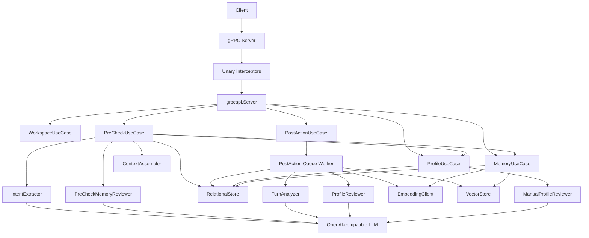

# 当前服务端完整流程审计

更新时间：2026-04-02  
审计范围：基于当前仓库代码实现，对本地 OSS 服务端运行时做静态代码审计。本文只描述“当前真实实现”，不把历史残留、测试替身或未装配能力误写成线上链路。

## 1. 结论先看

- 当前本地运行时只启动 `gRPC` 服务，不再装配 `HTTP` 服务。
- 当前运行时不内建 TLS；如果需要 TLS，预期由外部代理（如 `Caddy`）终止。
- 当前正式依赖装配方向符合仓库约束：`adapters -> app -> logic/domain`。
- 当前主业务链是：
  - `PreCheck`：实时意图判断 -> 统一记忆召回 -> 二次评审采纳 -> 组装上下文
  - `PostAction`：入站清洗 -> 可选噪声门控 -> turn 持久化 -> 异步单轮提炼 -> 写入统一记忆/画像
  - `WriteMemories`：工具侧主动写长期记忆，不经过二次 LLM 评审
  - `Profile`：查询活跃画像、组装 bundle、执行显式手工画像指令
- 当前 LLM / Embedding 只支持 `OpenAI-compatible` provider。
- 当前向量后端只支持 `LanceDB`。
- 当前关系存储后端只保留 `SQLite`，本地默认值也是 `SQLite`。
- 当前提示词系统已经实现模型路由与用户覆盖，但并非所有 prompt 文件都接在当前运行时热路径上。
- 当前 `PII Engine` 已实现规则加载与脱敏能力，但在 `app.NewLocal(...)` 中没有被装配进主链路。

## 2. 启动与装配总览

### 2.1 启动入口

- 入口文件：`cmd/vmm-local/main.go`
- 主要启动步骤：
  1. 解析可执行文件路径与当前工作目录
  2. 读取 `-config` 与 `-debug-clean`
  3. 调用 `config.ResolvePromptLayout(...)` 解析系统配置根与用户覆盖根
  4. 调用 `config.LoadPaths(...)` 合并配置
  5. 非 `debug-clean` 模式下加载提示词管理器 `config.NewPromptManager(...)`
  6. 调用 `app.NewLocal(...)` 装配应用
  7. 调用 `application.Run(...)` 启动 gRPC 服务

### 2.2 运行时依赖装配

- 装配文件：`internal/app/app.go`
- 当前装配出的核心依赖：
  - `LLMClient`：`internal/adapters/outbound/openai_native`
  - `EmbeddingClient`：`internal/adapters/outbound/openai_native`
  - `VectorStore`：`internal/adapters/outbound/vldb_lancedb`
  - `RelationalStore`：`internal/adapters/outbound/vldb_sqlite`
  - `NoiseGate`：`internal/logic/processor.NewNoiseGate(...)`
  - `WorkspaceUseCase`
  - `ProfileUseCase`
  - `MemoryUseCase`
  - `PreCheckUseCase`
  - `PostActionUseCase`

### 2.3 当前服务装配图



## 3. 配置、目录与覆盖规则

### 3.1 标准运行目录

仓库约束明确要求正式运行产物走标准构建入口：

- `.\make.ps1 build`
- `.\make.bat build`

标准目录结构：

- 二进制：`output/bin/vmm-local(.exe)`
- 配置：`output/configs/...`

系统配置底座按“可执行文件旁边的 `../configs`”解析，不应把根目录下手动 `go build` 产物当正式交付物。

### 3.2 配置链加载顺序

`internal/config/loader.go` 当前实现的配置链：

1. 系统配置：`<systemDir>/local.json`
2. 用户覆盖：
   - 默认：`~/.vmm/local.json`
   - 或 `-config` 指向的目录中的 `local.json`
   - 或 `-config` 显式传入的单文件

`-config` 现在语义是“覆盖根目录 / 覆盖配置文件”，而不是旧式“只指定一个 app 配置文件”。

### 3.3 Prompt / PII / Noise 目录

系统目录：

- `configs/prompts/...`
- `configs/pii_rules/...`
- `configs/noise_rules/...`

用户覆盖目录：

- `~/.vmm/prompts/...`
- `~/.vmm/pii_rules/...`
- `~/.vmm/noise_rules/...`

如果使用 `-config` 指向一个覆盖根，则覆盖目录变成：

- `<config-root>/prompts/...`
- `<config-root>/pii_rules/...`
- `<config-root>/noise_rules/...`

### 3.4 默认配置重点

来自 `internal/config/config.go` 的默认本地配置：

- `grpc.listen_addr = :8080`
- `grpc.max_receive_message_bytes = 1MB`
- `grpc.request_timeout.workspace = 15s`
- `grpc.request_timeout.pre_check = 8s`
- `grpc.request_timeout.post_action = 8s`
- `grpc.shutdown_timeout = 10s`
- `pii.default_language = zh-CN`
- `noise.enabled = true`
- `noise.semantic_enabled = true`
- `noise.semantic_threshold = 0.88`
- `sqlite.address = 127.0.0.1:19501`
- `lancedb.address = 127.0.0.1:19301`
- `llm.provider = openai`
- `llm.model = gpt-4.1-mini`
- `embedding.provider = openai`
- `embedding.model = text-embedding-3-large`
- `embedding.dimension = 1024`
- `vector.provider = lancedb`
- `relational.provider = sqlite`
- `post_action.input_mode = compat`
- `post_action.session_analysis_history_turns = 3`
- `post_action.session_analysis_max_input_tokens = 6000`
- `pre_check.intent_timeout = 5s`
- `pre_check.top_k = 5`
- `memory_pipeline.max_search_keywords = 5`
- `memory_pipeline.min_similarity_score = 0.75`

### 3.5 配置校验重点

当前启动阶段会强校验：

- `grpc.request_timeout.pre_check > pre_check.intent_timeout`
- `vector.provider` 必须是 `lancedb`
- `relational.provider` 必须是 `sqlite`
- `llm.provider` 和 `embedding.provider` 必须是 `OpenAI-compatible`
- `llm.endpoint/api_key/model` 必填
- `embedding.endpoint/api_key/model/dimension` 必填

## 4. gRPC 对外接口总览

Proto 文件：`internal/adapters/inbound/grpcapi/proto/v1/vmm.proto`

当前 `VMMService` 共开放 18 个 RPC：

| 分类 | RPC | 作用 |
| --- | --- | --- |
| Health | `Healthz` | 进程存活检查 |
| Workspace | `ListProjects` | 列出全部 Team/Space/Project |
| Workspace | `ResolveProject` | 解析项目 |
| Workspace | `EnsureProject` | 解析或创建项目路径 |
| Workspace | `DeleteProject` | 删除项目及其数据 |
| Workspace | `MigrateProject` | 迁移项目数据 |
| Workspace | `ResolveUser` | 解析或创建用户 |
| Workspace | `ListUsers` | 列出长期用户 |
| Workspace | `DeleteUser` | 删除用户及其数据 |
| Profile | `GetProfileNodes` | 查询活跃画像节点 |
| Profile | `GetProfileBundle` | 组装 TEAM/SPACE/PROJECT/USER bundle |
| Profile | `ApplyProfileInstruction` | 执行显式手工画像指令 |
| Memory | `SearchMemoryEvents` | 统一记忆搜索 |
| Memory | `GetTurnDetails` | 读取脱水 turn 详情 |
| Memory | `GetMemoryDetails` | 读取 memory / turn 混合详情 |
| Memory | `WriteMemories` | 主动写入长期记忆 |
| Main Chain | `PreCheck` | 实时预检与记忆注入 |
| Main Chain | `PostAction` | turn 持久化与异步提炼 |

## 5. gRPC 公共结构与枚举

### 5.1 关键消息体

#### `ProjectEntry`

- `project_id`：项目 ID
- `team_id`：所属团队 ID
- `space_id`：所属空间 ID
- `team_name`：团队名
- `space_name`：空间名
- `project_name`：项目名
- `display_path`：标准展示路径，形如 `Team/Space/Project`

#### `UserEntry`

- `user_id`：用户 ID
- `user_name`：用户名

#### `MemoryRef`

- `type`：引用类型，`MEMORY` 或 `TURN`
- `id`：对应行 ID

#### `ProfileNodeEntry`

- `profile_node_id`：画像节点 ID
- `target`：目标范围，`USER / PROJECT / TEAM / SPACE`
- `bind_id`：绑定对象 ID
- `content`：节点正文
- `priority`：`P0 / P1 / P2`
- `level`：`L0 / L1 / L2 / L3`
- `refresh_weight`：刷新权重
- `profile_date`：画像日期
- `expires_timestamp`：过期时间
- `level_reason`：等级原因
- `source_kind`：来源类型
- `source_id`：来源记录 ID

#### `TurnDetailEntry`

- `turn_id / session_id / project_id`
- `dehydrated_content`：落库时的脱水 JSON
- `dehydrated_budget`：脱水文本预算
- `extracted_status`：提炼状态
- `details`：提炼后的精要
- `details_budget`：精要预算
- `created_timestamp / updated_timestamp`
- `user_content / timeline / assistant_content`：服务端已帮调用方解开的结构化 turn
- `previous_turn_ids / next_turn_ids`：邻近 turn 锚点

#### `MemoryDetailEntry`

- `memory_id`
- `source_kind`
- `scope_level`
- `memory_status`
- `team_id / space_id / project_id / user_id`
- `origin_session_id`
- `source_turn_id`
- `category`
- `abstract / details`
- `priority / memory_level`
- `refresh_weight`
- `status_reason`
- `expires_timestamp`
- `last_recalled_timestamp / last_adopted_timestamp`
- `recalled_count / adopted_count / cross_session_adopted_count`
- `created_timestamp / updated_timestamp`

#### `WriteMemoryItem`

- `scope_level`：`SESSION / PROJECT / USER`
- `abstract`：高密度摘要，直接做 embedding
- `details`：完整描述
- `category`：记忆分类
- `priority`：`P0 / P1 / P2`
- `memory_level`：`L0 / L1 / L2 / L3`
- `expires_timestamp`：显式 TTL 截止时间

#### `ContextItem`

- `kind`：`project_constraint / persona / preference / memory`
- `title`：展示标题
- `text`：正文
- `source`：`persona` 或 `vector`
- `score`：仅记忆召回项有意义

#### `PostActionTimelineItem`

- `type`：只允许 `user` 或 `assistant`
- `content`：中间消息内容

### 5.2 关键枚举

#### `ProfileTarget`

- `USER`
- `PROJECT`
- `TEAM`
- `SPACE`

#### `ProfileNodeSourceKind`

- `TURN_EXTRACT`
- `MANUAL_INSTRUCTION`
- `SYSTEM_SEED`
- `RETAINED_AFTER_USER_DELETE`

#### `MemorySourceKind`

- `TURN_EXTRACT`
- `GRPC_AI_WRITE`
- `SYSTEM_SEED`
- `LEGACY_ENTRY`

#### `MemoryScopeLevel`

- `SESSION`
- `PROJECT`
- `USER`

#### `MemoryStatus`

- `ACTIVE`
- `SUPERSEDED`
- `DELETED`
- `EXPIRED`

#### `MemoryPriority`

- `P0`
- `P1`
- `P2`

#### `MemoryLevel`

- `L0`
- `L1`
- `L2`
- `L3`

#### `ProfileBundleMode`

- `FULL`
- `SPLIT`

## 6. gRPC 接口详解

### 6.1 Health / Workspace

#### `Healthz`

- 请求：`google.protobuf.Empty`
- 返回：
  - `status`
  - `trace_id`

#### `ListProjects`

- 请求：空
- 返回：
  - `projects[]: ProjectEntry`
  - `trace_id`

#### `ResolveProject`

- 请求：
  - `project_ref`：数字项目 ID 或标准路径
- 返回：
  - `project: ProjectEntry`
  - `message`
  - `trace_id`

#### `EnsureProject`

- 请求：
  - `project_path`
  - `confirm_create`
- 返回：
  - `project`
  - `message`
  - `exists`
  - `needs_confirm`
  - `created_team`
  - `created_space`
  - `created_project`
  - `missing_team`
  - `missing_space`
  - `trace_id`

#### `DeleteProject`

- 请求：
  - `project_path`
  - `confirm_delete`
- 返回：
  - `project`
  - `message`
  - `needs_confirm`
  - `deleted_sessions`
  - `deleted_messages`
  - `deleted_memories`
  - `deleted_vector_rows`
  - `deleted_projects`
  - `deleted_spaces`
  - `deleted_teams`
  - `deleted_profiles`
  - `trace_id`

#### `MigrateProject`

- 请求：
  - `source_project_path`
  - `target_project_path`
  - `confirm_migrate`
- 返回：
  - `source_project`
  - `target_project`
  - `message`
  - `needs_confirm`
  - `migrated_sessions`
  - `migrated_messages`
  - `migrated_memories`
  - `rebuilt_vector_rows`
  - `trace_id`

#### `ResolveUser`

- 请求：
  - `user_ref`：数字 ID 或用户名
  - `confirm_create`
- 返回：
  - `user`
  - `message`
  - `created`
  - `exists`
  - `trace_id`

#### `ListUsers`

- 请求：空
- 返回：
  - `users[]`
  - `trace_id`

#### `DeleteUser`

- 请求：
  - `user_ref`
  - `confirmation_code`
- 返回：
  - `user`
  - `message`
  - `requires_confirmation`
  - `confirmation_code`
  - `deleted_sessions`
  - `deleted_messages`
  - `deleted_memories`
  - `deleted_vector_rows`
  - `deleted_users`
  - `deleted_profiles`
  - `trace_id`

### 6.2 Profile

#### `GetProfileNodes`

- 请求：
  - `target`
  - `user_id`
  - `project_id`
  - `limit`
- 返回：
  - `nodes[]: ProfileNodeEntry`
  - `trace_id`
- 规则：
  - `USER` 目标时必须给 `user_id`
  - 其他目标必须给 `project_id`

#### `GetProfileBundle`

- 请求：
  - `user_id`
  - `project_id`
  - `mode`
  - `include_explanation`（可选）
- 返回：
  - `mode`
  - `include_explanation`
  - `explanation_text`
  - `environment_priority_text`
  - `combined_text`
  - `team_profile`
  - `space_profile`
  - `project_profile`
  - `user_profile`
  - `trace_id`
- 当前实现细节：
  - `FULL` 模式默认把 `include_explanation` 归一成 `true`
  - `SPLIT` 模式默认归一成 `false`
  - `FULL` 模式下 `combined_text` 是权威输出，服务端会主动清空 split 字段和 explanation 字段
  - `environment_priority_text` 字段当前实现中基本为空

#### `ApplyProfileInstruction`

- 请求：
  - `target`
  - `user_id`
  - `project_id`
  - `instruction`
- 返回：
  - `instruction_id`
  - `accepted_nodes[]`
  - `retired_nodes[]`
  - `review_reason`
  - `trace_id`
- 当前实现特性：
  - 对同一目标串行化
  - 相同目标 + 相同指令的并发请求做 flight 去重
  - `TEAM / SPACE` 强制 authority floor 为 `P0 / L3`
  - `USER / PROJECT` 若检测到“必须 / 禁止 / 统一 / 改成 / use only”等硬指令，则 floor 提升到 `P0 / L2`
  - 普通显式手工指令 floor 为 `P1 / L2`

### 6.3 Memory

#### `SearchMemoryEvents`

- 请求：
  - `user_id`
  - `project_id`
  - `query_json`
  - `top_k`
- 返回：
  - `results[]: MemorySearchGroupResult`
  - `trace_id`
- `query_json` 必须是 JSON 数组，元素形如：

```json
[
  {
    "background": "当前上下文",
    "query": "需要检索的关键完整语句"
  }
]
```

- 当前实现细节：
  - 传输层允许 `top_k <= 64`
  - 但用例层实际会把 `top_k` 再钳制到最大 `32`
  - 每个请求最多 `16` 个 query item

#### `GetTurnDetails`

- 请求：
  - `turn_ids[]`
- 返回：
  - `turns[]: TurnDetailEntry`
  - `trace_id`
- 限制：
  - 至少 1 个
  - 最多 256 个

#### `GetMemoryDetails`

- 请求：
  - `refs[]: MemoryRef`
- 返回：
  - `items[]: MemoryDetailItem`
  - `trace_id`
- 特性：
  - 支持混合查询 `MEMORY` 与 `TURN`
  - 按调用方原顺序返回
  - 最多 256 个 ref

#### `WriteMemories`

- 请求：
  - `session_id`
  - `user_id`
  - `project_id`
  - `items[]: WriteMemoryItem`
- 返回：
  - `items[]: WriteMemoryResultItem`
  - `trace_id`
- 当前实现默认值：
  - 默认 `scope_level = PROJECT`
  - 默认 `priority = P2`
  - 默认 `memory_level`：
    - `SESSION -> L0`
    - 其他 -> `L2`
  - 默认 TTL：
    - `SESSION = 15 天`
    - `PROJECT = 180 天`
    - `USER = 365 天`
- 当前实现特性：
  - 24 小时软幂等窗口
  - dedupe hash 基于：
    - `source_kind`
    - `scope_level`
    - `session_id`
    - `abstract`
    - `details`

### 6.4 Main Chain

#### `PreCheck`

- 请求：
  - `session_id`
  - `user_id`
  - `project_id`
  - `user_content`
- 返回：
  - `should_inject`
  - `context_text`
  - `context_items[]`
  - `degraded`
  - `trace_id`
- 传输层校验：
  - `session_id` 必填，最大 128 字符
  - `user_content` 必填，最大 16000 字符

#### `PostAction`

- 请求：
  - `session_id`
  - `user_id`
  - `project_id`
  - `user_content`
  - `assistant_content`
  - `timeline[]`
- 返回：
  - `accepted`
  - `trace_id`
- 传输层校验：
  - `session_id` 必填，最大 128 字符
  - `user_content` / `assistant_content` 必填，最大 16000 字符
  - `timeline[i].type` 只允许 `user` / `assistant`
  - `timeline[i].content` 最大 16000 字符

## 7. gRPC 拦截器链与错误模型

### 7.1 一元拦截器顺序

来自 `internal/adapters/inbound/grpcapi/interceptors.go`：

1. `RecoveryInterceptor`
2. `TraceIDInterceptor`
3. `ScopeResolutionInterceptor`
4. `RequestLoggerInterceptor`
5. 额外拦截器

### 7.2 Trace 规则

- 优先复用入站 header `x-trace-id`
- 若没有，则生成新 trace id
- 同时写回 gRPC header
- 调用 OpenAI 兼容模型时，会把 trace 继续透传为：
  - `X-Trace-ID`
  - `X-Client-Request-Id`

### 7.3 Scope 解析规则

只有 3 个 RPC 会在进入 handler 前强制解析 scope：

- `/vmm.v1.VMMService/PreCheck`
- `/vmm.v1.VMMService/PostAction`
- `/vmm.v1.VMMService/WriteMemories`

解析结果是 `SessionRef`，会写进 context，业务层直接复用，不再重复查 scope。

### 7.4 标准错误目录

当前 gRPC 会通过 `ErrorInfo.reason` 返回稳定错误码：

- `GRPC_VALIDATION_FAILED`
- `GRPC_ROUTE_DISABLED`
- `RESOURCE_NOT_FOUND`
- `RESOURCE_CONFLICT`
- `CONFIRMATION_REQUIRED`
- `STORAGE_OUTCOME_UNCERTAIN`
- `UPSTREAM_TIMEOUT`
- `INTERNAL_ERROR`
- `GRPC_REQUEST_TOO_LARGE`

## 8. 端到端业务流程

### 8.1 `PreCheck` 完整流程

`internal/app/usecase/precheck.go` 当前真实流程：

1. 校验 `SessionRef` 与 `user_content`
2. 调用 `ProfileUseCase.GetBundle(... SPLIT ...)` 加载 TEAM/SPACE/PROJECT/USER 画像
3. 从关系存储读取最近 turn 窗口
4. 若 turn 已完成提炼且 `details` 非空，则把该 turn 作为 `DETAILS`
5. 否则把该 turn 的 `dehydrated_content` 作为 `RAW_TURN`
6. 按 token budget 裁剪最近 turn 窗口
7. 第一层 LLM：`IntentExtractor` + `extract_intent.md`
8. 若 `need_memory = false`，直接返回 persona-only 上下文
9. 若需要记忆，则把 stage-1 query 组装成统一记忆查询 JSON
10. 复用 `MemoryUseCase.Search(...)` 做向量召回
11. 依据 `min_similarity_score` 去掉低分候选
12. 去重、排序、编号，形成 stage-2 candidates
13. 第二层 LLM：`PreCheckMemoryReviewer` + `review_precheck_memory.md`
14. 将选中的 `candidate_number` 映射回 `memory_id`
15. 对采纳的 memory 执行 `ApplyMemoryAdoption(...)`
16. 调用 `ContextAssembler` 拼装 `context_text + context_items`
17. 若某些步骤失败但还能返回部分结果，则 `degraded = true`

#### `PreCheck` 输入给第一层 LLM 的 JSON 形态

```json
{
  "recent_turns": [
    {
      "turn_id": 1001,
      "content_type": "DETAILS",
      "content": "上一轮提炼后的摘要"
    }
  ],
  "current_user_input": "当前用户问题",
  "max_search_queries": 5
}
```

#### `PreCheck` 二层评审输入 JSON 形态

```json
{
  "user_content": "当前用户问题",
  "search_queries": ["检索语句"],
  "intent_reason": "为什么需要记忆",
  "candidates": [
    {
      "candidate_number": 1,
      "memory_id": 10,
      "abstract": "高密度摘要"
    }
  ]
}
```

#### `PreCheck` 最终输出语义

- `should_inject = len(context_items) > 0`
- `context_text`：注入上游模型的可读文本
- `context_items`：结构化上下文块
- `degraded`：部分链路失败但仍返回了降级结果

### 8.2 `PostAction` 完整流程

`internal/adapters/inbound/grpcapi/server.go` + `internal/app/usecase/postaction.go` 当前真实流程：

1. transport normalize：
   - trim `session_id`
   - trim `user_content`
   - trim `assistant_content`
   - trim / lowercase `timeline.type`
2. transport validate
3. scope interceptor 解析 `SessionRef`
4. server 复制出两份请求：
   - `rawReq`
   - `cleanedReq`
5. `cleanedReq` 经过 `PostActionTextSanitizer`
6. server 会分别记录原始 payload 和清洗后 payload
7. 若 `timeline` 为空，先走 `NoiseGate`
8. 若噪声门判定应丢弃，则直接返回 `accepted = true`，但不落长期 turn
9. 校验 `turnAnalyzer` 已装配
10. 将清洗后的 turn 立即写入 `vmm_turn_records`
11. 将对应 session 入异步队列
12. RPC 立即返回，不等待 LLM 提炼

#### 异步队列阶段

`internal/app/usecase/postaction_queue.go` + `postaction.go`

1. 队列对 session 去重
2. 周期性扫描 idle pending sessions，默认每 30 秒一次
3. 读取某 session 所有待处理 turn
4. 对每个 pending turn：
   - 从 `dehydrated_content` 还原 raw turn
   - 构造 `TurnAnalysisInput`
   - 调用 `TurnAnalyzer` + `analyze_turn.md`
   - 校验 `turn_id` 一致
   - 评审新画像候选 `ProfileReviewer + review_profile_nodes.md`
   - 对记忆摘要做 embedding
   - 写入 LanceDB
   - `ApplyTurnAnalysis(...)` 回写 SQL：
     - turn `details`
     - memory nodes
     - profile nodes
     - supersede 状态
     - profile blob
   - 推进 session extract window
   - 清理 superseded vector ids

#### `PostAction` 给单轮分析器的 JSON 输入

```json
{
  "reference_turns": [
    {
      "turn_id": 1000,
      "details": "历史精要"
    }
  ],
  "target_turn": {
    "turn_id": 1001,
    "raw_turn": {
      "user": "用户输入",
      "timeline": [],
      "assistant": "助手输出"
    }
  },
  "active_memory_nodes": [
    {
      "memory_id": 88,
      "category": 5,
      "abstract": "当前活跃记忆摘要",
      "details": "当前活跃记忆详情"
    }
  ],
  "recent_grpc_memory_writes": [
    {
      "memory_id": 99,
      "scope_level": "project",
      "abstract": "工具链刚写过的事实",
      "details": "更完整说明"
    }
  ]
}
```

### 8.3 `WriteMemories` 完整流程

`internal/app/usecase/memory_query.go`

1. 校验 resolved session 与 items
2. 对每个 item 补默认值
3. 生成 dedupe hash
4. 查 24 小时内是否已存在等价 active 记忆
5. 若存在：
   - 返回已有 `memory_ref`
   - `deduped = true`
6. 若不存在：
   - 对 `abstract` 做 embedding
   - 写 LanceDB
   - 创建 unified memory row
   - 返回新 `memory_ref`

### 8.4 `ApplyProfileInstruction` 完整流程

`internal/app/usecase/profile.go`

1. 校验 target / ids / instruction
2. resolve profile target
3. 对同 target 同 instruction 做并发去重
4. 对同 target 加串行 gate
5. 读取 active profile nodes
6. 先创建 `profile_instruction` 记录
7. 计算 authority floor
8. 调用 `ManualProfileReviewer` + `review_profile_instruction.md`
9. 对 reviewer 输出做 materialize：
   - 补齐 floor
   - 生成 accepted candidates
   - 生成 retired decisions
   - 重新渲染 profile blob
10. 调用 `ApplyManualProfileInstruction(...)` 落库
11. 返回 accepted / retired 节点及 review_reason

## 9. Prompt 系统

### 9.1 Prompt 路由

路由文件：`configs/prompts-routes.json`

```json
{
  "qwen3.5-flash": "qwen3.5-flash",
  "qwen3.5*": "qwen3.5-base",
  "*": "default"
}
```

路由规则：

- 最长前缀优先
- 用户目录中的 `prompts-routes.json` 可以覆盖系统路由
- `GetPrompt(...)` 读取时，优先用户目录，未命中再回退系统目录

### 9.2 当前 prompt 文件清单

`configs/prompts/default/`

- `extract_intent.md`
- `assemble_context.md`
- `analyze_turn.md`
- `merge_profile.md`
- `review_precheck_memory.md`
- `review_profile_instruction.md`
- `review_profile_nodes.md`
- `summarize_entry.md`

### 9.3 当前真正接到热路径的 prompt

#### 真实运行中会调用

- `extract_intent.md`
  - 用途：PreCheck 第一层检索规划
  - 输出：`need_memory + queries + reason`
- `review_precheck_memory.md`
  - 用途：PreCheck 第二层记忆采纳
  - 输出：`selected_candidate_numbers + reason`
- `analyze_turn.md`
  - 用途：PostAction 单轮提炼
  - 输出：`turn_id + details + memory_nodes + profile_nodes + superseded_memory_ids`
- `review_profile_nodes.md`
  - 用途：PostAction 中的新画像候选评审
  - 输出：分 target 的 accepted/invalid/retire-only 决策
- `review_profile_instruction.md`
  - 用途：显式手工画像指令评审
  - 输出：`accepted_nodes + retired_nodes + reason`
- `assemble_context.md`
  - 当前作用：会被加载校验存在性
  - 当前实际：上下文不是由 LLM 生成，而是由本地确定性代码拼装

#### 文件存在，但当前本地运行时没有真正装配进热路径

- `merge_profile.md`
  - 代码中存在 `ProfileMerger`
  - 但 `app.NewLocal(...)` 当前没有装配这个处理器
- `summarize_entry.md`
  - 代码中存在 `EntrySummarizer`
  - 但当前本地运行时没有接入主链

### 9.4 Prompt 调用模式

LLM 端口定义位于 `internal/app/ports/llm.go`：

- `SystemPrompt`
- `UserPrompt`
- `ResponseFormat`

当前处理器基本都按如下方式调用：

- `SystemPrompt = scene markdown`
- `UserPrompt = render 出来的 JSON 请求体`
- `ResponseFormat = json`

当前 provider 适配器是 `internal/adapters/outbound/openai_native/llm.go`，使用官方 OpenAI SDK Chat Completions 接口。

## 10. 文本清洗、噪声门控、PII 规则

### 10.1 PostAction 文本清洗

`internal/platform/textutil/postaction_sanitizer.go`

当前清洗顺序：

1. `CleanConversationTextForMemory`
   - 去掉 markdown image
   - 去掉资源链接 / media 标签 / data URL
   - 去掉 `<think>` 标签，但保留必要布局
2. `CleanMemoryTextWithConfig`
   - 折叠长代码、日志、堆栈、结构化机器文本
3. `NormalizeMemoryWhitespace`
4. `EnforceTokenBudget`
5. 最后再做一次 `NormalizeMemoryWhitespace`

### 10.2 NoiseGate

`internal/logic/processor/noise_gate.go` + `noise_rules.go`

当前特征：

- 支持 regex + semantic 双重噪声门
- 规则来源：
  - system `noise_rules`
  - user override `noise_rules`
- user 规则优先，system 规则兜底
- 每个 category 可带：
  - `name`
  - `targets`
  - `threshold`
  - `patterns`
  - `phrases`

当前非常关键的实现细节：

- `PostAction` 只有在 `timeline` 为空时才执行 `NoiseGate`
- 如果带 `timeline`，认为它不是简单单轮问答，直接跳过噪声门

### 10.3 PII Engine

`internal/platform/pii/engine.go`

当前能力：

- 先加载系统 `pii_rules`
- 再按语言标签叠加用户覆盖
- `Scrub(text, lang)` 会按语言规则替换敏感信息

但当前实现状态：

- `PII Engine` 已实现
- 当前 `app.NewLocal(...)` 没有把它装配到主业务链路
- 也就是说，当前运行时主链路中并没有自动执行 PII 脱敏

## 11. 存储结构与字段作用

### 11.1 当前正式 SQLite schema

来自 `internal/adapters/outbound/vldb_sqlite/store.go` 的 `currentSchemaSQL`

| 表 | 作用 | 核心字段 |
| --- | --- | --- |
| `vmm_version` | schema 版本表 | `singleton_id, schema_version, updated_at` |
| `vmm_noise_embeddings` | 噪声语义向量缓存 | `scope, language, category_name, phrase, model, dimension, rules_hash, vector_json` |
| `vmm_users` | 用户主表 | `id, name, profile, delete_confirm_code, created_at, updated_at` |
| `vmm_teams` | 团队主表 | `id, name, profile` |
| `vmm_spaces` | 空间主表 | `id, team_id, name, profile` |
| `vmm_projects` | 项目主表 | `id, team_id, space_id, name, profile` |
| `vmm_sessions` | 会话主表 | `session_key, user_id, team_id, space_id, project_id, turn_count, summarize_*, last_extract_*` |
| `vmm_turn_records` | turn 持久化表 | `dehydrated_content, dehydrated_budget, extracted_status, details, details_budget` |
| `vmm_memory_nodes` | 统一长期记忆表 | `origin_session_id, source_turn_id, vector_id, source_kind, scope_level, category, abstract, details, memory_status, priority, memory_level, refresh_weight, expires_timestamp, dedupe_hash, adoption counters` |
| `vmm_profile_nodes` | 原子画像节点表 | `turn_id, profile_type, bind_id, content, profile_status, priority, profile_level, level_reason, refresh_weight, source_kind, source_id, expires_timestamp, superseded_by_id, profile_date` |
| `vmm_profile_instructions` | 手工画像指令表 | `profile_type, bind_id, instruction, instruction_status, review_result_json, failure_reason` |

### 11.2 核心表字段语义

#### `vmm_sessions`

- `session_key`：业务侧传入的外部会话键
- `user_id / team_id / space_id / project_id`：确定作用域
- `turn_count`：当前 session 已持久化 turn 数
- `last_summarized_id / summarize_content / summarize_budget`：旧总结链路遗留字段
- `last_extract_observed_timestamp`：异步提炼观察窗口起点
- `last_extract_completed_timestamp`：异步提炼完成时间

#### `vmm_turn_records`

- `dehydrated_content`：落库时的原始 turn JSON，结构是：

```json
{
  "user": "用户消息",
  "timeline": [
    {
      "type": "assistant",
      "content": "中间消息"
    }
  ],
  "assistant": "最终回复"
}
```

- `extracted_status`：是否已被异步提炼
- `details`：提炼后的高密度摘要
- `details_budget`：摘要 token 预算

#### `vmm_memory_nodes`

- `origin_session_id`：最初来源 session
- `source_turn_id`：若来自 turn 提炼，则关联源 turn
- `vector_id`：LanceDB 行 id
- `vector_json`：向量副本
- `source_kind`：来源类型
- `scope_level`：`SESSION / PROJECT / USER`
- `category`：记忆分类
- `abstract`：摘要，直接参与 embedding
- `details`：完整说明
- `memory_status`：active / superseded / deleted / expired
- `priority`：P 等级
- `memory_level`：L 等级
- `refresh_weight`：刷新权重
- `status_reason`：状态原因
- `expires_timestamp`：过期时间
- `last_recalled_timestamp`：最近被召回时间
- `last_adopted_timestamp`：最近被 PreCheck 真正采纳时间
- `recalled_count / adopted_count / cross_session_adopted_count`：生命周期计数
- `dedupe_hash`：主动写记忆的软幂等哈希

#### `vmm_profile_nodes`

- `turn_id`：若来自 turn 提炼，关联 turn
- `profile_type`：`USER / PROJECT / TEAM / SPACE`
- `bind_id`：绑定对象 ID
- `content`：原子画像节点正文
- `profile_status`：active / pending / retired 等
- `priority / profile_level / level_reason`
- `refresh_weight`
- `source_kind / source_id`
- `status_reason`
- `expires_timestamp`
- `superseded_by_id`
- `profile_date`

### 11.3 当前关键存储行为

#### `ResolveRequestScope`

- 校验 `session_key / user_id / project_id`
- 校验 user 与 project 是否存在
- 若 `(project_id, session_key)` 对应的 session 不存在，会自动创建

#### `AppendTurnRecord`

- 把 turn 变成脱水 JSON
- 估算 token budget
- 插入 `vmm_turn_records`
- 递增 `vmm_sessions.turn_count`

#### `ApplyTurnAnalysis`

- 回写 turn `details`
- 插入 memory nodes
- 插入 profile nodes
- 更新 profile blob
- supersede 被覆盖记忆

#### `LoadRecentSessionTurns`

- 读取最近落库 turn
- 不要求这些 turn 已经完成提炼

#### `LoadRecentSessionHistory`

- 只读取已经提炼完成且 `details` 非空的 turn

#### `LoadRecentDirectMemoryWrites`

- 读取最近窗口内通过 `GRPC_AI_WRITE` 主动写入的活跃记忆
- 用来避免 turn analyzer 重复提炼

#### `ApplyMemoryAdoption`

- PreCheck 采纳后递增 adoption / recall 类计数
- 热 session 事实跨会话命中后可被提升

## 12. 实现现状与注意事项

### 12.1 `review_precheck_memory.md` 已被运行时调用，但不在 `RequiredScenes` 中

`internal/config/loader.go` 的 `RequiredScenes` 当前只校验：

- `extract_intent.md`
- `assemble_context.md`
- `analyze_turn.md`
- `summarize_entry.md`
- `merge_profile.md`
- `review_profile_nodes.md`
- `review_profile_instruction.md`

但 `PreCheckMemoryReviewer` 运行时实际会加载 `review_precheck_memory.md`。  
这意味着：如果某个 prompt 包缺这个文件，启动前未必能在 `RequiredScenes` 阶段被提前挡住。

### 12.2 `assemble_context.md` 目前只是“存在性依赖”，不是实际生成器

`ContextAssembler.Assemble(...)` 会先尝试加载 `assemble_context` prompt，但最终上下文是本地确定性代码拼出来的，不会把召回结果再发给 LLM 生成一版新文案。

### 12.3 `merge_profile.md` / `summarize_entry.md` 当前不在本地运行时热路径

这些处理器代码和 prompt 文件都还在，但 `app.NewLocal(...)` 当前没有把它们装配进真实主链。

### 12.4 `environment_priority_text` 协议字段当前实现基本为空

Proto 有该字段，server 也会回填，但 `ProfileBundleUseCase` 当前并没有真正构造有效的 `EnvironmentPriority` 内容。

### 12.5 `SearchMemoryEvents.top_k` 的“协议上限”和“实际有效上限”不一致

- transport validate：允许 `top_k <= 64`
- usecase normalize：最终最多只取 `32`

### 12.6 DuckDB 基线 SQL 已从当前项目移除

旧的 `deploy/sql/001_init.sql` DuckDB 基线文件已从当前项目移除，当前正式 schema 只保留 SQLite 网关基线。

- `vmm_turn_records` 缺少 `details / details_budget`
- `vmm_sessions` 缺少 `last_extract_observed_timestamp / last_extract_completed_timestamp`
- 仍使用旧的 `vmm_memory_entries`
- 缺少统一的 `vmm_memory_nodes / vmm_profile_nodes / vmm_profile_instructions`

因此当前“最完整、最新”的正式 schema 应以 `SQLite currentSchemaSQL` 为准。

## 13. 关键源码索引

### 13.1 启动与装配

- `cmd/vmm-local/main.go`
- `internal/app/app.go`

### 13.2 gRPC 入口

- `internal/adapters/inbound/grpcapi/proto/v1/vmm.proto`
- `internal/adapters/inbound/grpcapi/server.go`
- `internal/adapters/inbound/grpcapi/interceptors.go`
- `internal/adapters/inbound/grpcapi/validation.go`
- `internal/adapters/inbound/grpcapi/errors.go`

### 13.3 用例层

- `internal/app/usecase/precheck.go`
- `internal/app/usecase/postaction.go`
- `internal/app/usecase/postaction_queue.go`
- `internal/app/usecase/memory_query.go`
- `internal/app/usecase/profile.go`
- `internal/app/usecase/profile_bundle.go`

### 13.4 处理器层

- `internal/logic/processor/intent_extractor.go`
- `internal/logic/processor/precheck_memory_reviewer.go`
- `internal/logic/processor/context_assembler.go`
- `internal/logic/processor/turn_analyzer.go`
- `internal/logic/processor/profile_reviewer.go`
- `internal/logic/processor/manual_profile_reviewer.go`
- `internal/logic/processor/render.go`
- `internal/logic/processor/noise_gate.go`
- `internal/logic/processor/noise_rules.go`

### 13.5 平台与配置

- `internal/config/config.go`
- `internal/config/loader.go`
- `internal/config/manager.go`
- `internal/platform/textutil/postaction_sanitizer.go`
- `internal/platform/pii/engine.go`

### 13.6 存储与适配器

- `internal/adapters/outbound/vldb_sqlite/store.go`
- `internal/adapters/outbound/vldb_sqlite/store.go`
- `internal/adapters/outbound/vldb_lancedb/store.go`
- `internal/adapters/outbound/openai_native/llm.go`

## 14. 审计结论

如果只看“当前真实服务端”，可以把它理解成一套以 `gRPC + SQLite/LanceDB + OpenAI-compatible LLM` 为核心的本地长期记忆服务：

- `PreCheck` 负责在回答前做“是否需要历史记忆”的实时判断
- `PostAction` 负责把本轮对话稳定落库，并异步提炼成长记忆与画像
- `WriteMemories` 负责工具链主动写记忆
- `Profile` 负责查询与显式修正长期画像

同时要注意，当前仓库中仍保留了一些旧能力和未接线部件，因此做二开或联调时，应优先以本文标注的“当前真实热路径”和 `SQLite currentSchemaSQL` 为准，而不是看到文件存在就默认能力已生效。
