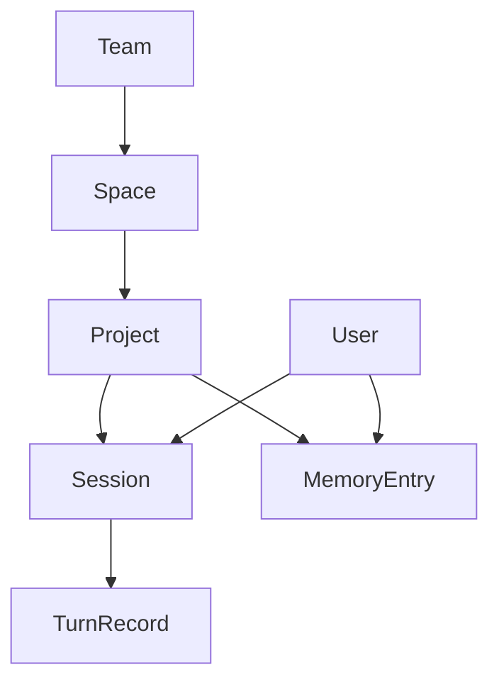

# VMM 层级数据模型与 gRPC 设计（中文）

## 文档目标

这份文档记录当前主线版本采用的：

- Team / Space / Project / User 层级模型
- DuckDB 基础表结构
- gRPC 对外契约
- `PreCheck` / `PostAction` 的核心实现逻辑

这是一份“当前实现口径”文档，不是历史兼容说明。

## 一、设计目标

当前版本采用“确定性层级寻址”：

- 客户端常规业务调用只传：
  - `project_id`
  - `user_id`
  - `session_id`
- 服务端根据 `project_id` 反查出核心冗余坐标：
  - `team_id`
  - `space_id`
- 这些冗余层级坐标会继续写入：
  - SQL 存储
  - 向量存储

这样做的目的：

1. 客户端契约更简单
2. 服务端查询过滤更快
3. LanceDB 可以直接按扁平化坐标做过滤

## 二、当前层级模型

层级关系如下：



说明：

- `Team -> Space -> Project` 是确定性层级树
- `Session` 绑定：
  - `user_id`
  - `team_id`
  - `space_id`
  - `project_id`
- `TurnRecord` 属于某个 `Session`
- `MemoryEntry` 属于某个 `Project` 和 `User`

## 三、DuckDB 表结构

当前基线 SQL 文件：

- [deploy/sql/001_init.sql](../deploy/sql/001_init.sql)

核心表如下。

### 1. 版本表

```sql
CREATE TABLE IF NOT EXISTS vmm_version (
    singleton_id   INTEGER PRIMARY KEY,
    schema_version INTEGER NOT NULL,
    updated_at     TEXT    NOT NULL DEFAULT ''
);
```

用途：

- 记录当前 DuckDB schema 版本
- 启动时判断是否需要重置调试阶段的受管表

### 2. 用户与层级表

```sql
CREATE TABLE IF NOT EXISTS vmm_users (
    id                  BIGINT PRIMARY KEY,
    name                TEXT NOT NULL UNIQUE,
    delete_confirm_code TEXT NOT NULL DEFAULT '',
    created_at          TEXT NOT NULL,
    updated_at          TEXT NOT NULL
);

CREATE TABLE IF NOT EXISTS vmm_teams (
    id         BIGINT PRIMARY KEY,
    name       TEXT NOT NULL UNIQUE,
    created_at TEXT NOT NULL,
    updated_at TEXT NOT NULL
);

CREATE TABLE IF NOT EXISTS vmm_spaces (
    id         BIGINT PRIMARY KEY,
    team_id    BIGINT NOT NULL,
    name       TEXT   NOT NULL,
    created_at TEXT   NOT NULL,
    updated_at TEXT   NOT NULL,
    UNIQUE(team_id, name)
);

CREATE TABLE IF NOT EXISTS vmm_projects (
    id         BIGINT PRIMARY KEY,
    team_id    BIGINT NOT NULL,
    space_id   BIGINT NOT NULL,
    name       TEXT   NOT NULL,
    created_at TEXT   NOT NULL,
    updated_at TEXT   NOT NULL,
    UNIQUE(space_id, name)
);
```

说明：

- `team.name` 全局唯一
- `space.name` 在 `team_id` 内唯一
- `project.name` 在 `space_id` 内唯一

### 3. Session 表

```sql
CREATE TABLE IF NOT EXISTS vmm_sessions (
    id                 BIGINT PRIMARY KEY,
    session_key        TEXT    NOT NULL,
    user_id            BIGINT  NOT NULL,
    team_id            BIGINT  NOT NULL,
    space_id           BIGINT  NOT NULL,
    project_id         BIGINT  NOT NULL,
    turn_count         INTEGER NOT NULL DEFAULT 0,
    last_summarized_id BIGINT  NOT NULL DEFAULT 0,
    summarize_content  TEXT    NOT NULL DEFAULT '',
    summarize_budget   INTEGER NOT NULL DEFAULT 0,
    created_timestamp  BIGINT  NOT NULL,
    updated_timestamp  BIGINT  NOT NULL,
    UNIQUE(project_id, session_key)
);
```

说明：

 - `session_key` 是客户端传入的业务会话键
 - `id` 是内部数字主键
 - `turn_count` 表示当前 session 下已经成功持久化的 turn 数
 - `last_summarized_id` 为后续宏观总结流程预留
 - 时间字段统一使用毫秒时间戳

### 4. Turn 表

```sql
CREATE TABLE IF NOT EXISTS vmm_turn_records (
    id                 BIGINT PRIMARY KEY,
    session_id         BIGINT  NOT NULL,
    project_id         BIGINT  NOT NULL,
    dehydrated_content TEXT    NOT NULL,
    dehydrated_budget  INTEGER NOT NULL DEFAULT 0,
    extracted_status   TINYINT NOT NULL DEFAULT 0,
    created_timestamp  BIGINT  NOT NULL,
    updated_timestamp  BIGINT  NOT NULL
);
```

说明：

当前 `PostAction` 按 turn 级存储，而不是再拆成多条消息行。

当前会保存一条脱水 JSON 文本：

1. 顶层 `user_content`
2. 原始 `timeline[]`
3. 顶层 `assistant_content`

其中：

- `timeline` 里的 `assistant` 节点会被脱水成固定占位文本
- `dehydrated_budget` 来自脱水 JSON 的 token 预算估算

### 5. 记忆表

```sql
CREATE TABLE IF NOT EXISTS vmm_memory_entries (
    id            TEXT   PRIMARY KEY,
    team_id       BIGINT NOT NULL,
    space_id      BIGINT NOT NULL,
    project_id    BIGINT NOT NULL,
    session_id    BIGINT NOT NULL,
    user_id       BIGINT NOT NULL,
    content       TEXT   NOT NULL,
    vector_json   TEXT   NOT NULL DEFAULT '[]',
    metadata_json TEXT   NOT NULL DEFAULT '{}',
    created_at    TEXT   NOT NULL,
    updated_at    TEXT   NOT NULL
);
```

说明：

- 当前主线已经预留长期记忆表
- `PreCheck` 已接回实时两层召回与采纳
- 当前 turn 的即时提炼结果会直接写进这里，并参与后续检索

## 四、LanceDB 扁平化元数据

当前 LanceDB 存储行会扁平化写入这些字段：

```text
team_id
space_id
project_id
session_id
user_id
```

这样可以直接按数值过滤：

```text
team_id = X
space_id = Y
project_id = Z
session_id = N
user_id = U
```

当前基础表名来自：

- `lancedb.table_name`

运行时会自动按 embedding 维度追加后缀，例如：

- `vmm_memory_vectors_1024`

## 五、gRPC 服务定义

当前 proto 文件：

- [internal/adapters/inbound/grpcapi/proto/v1/vmm.proto](../internal/adapters/inbound/grpcapi/proto/v1/vmm.proto)

当前服务：

- `vmm.v1.VMMService`

### 1. 管理面方法

- `ListProjects`
- `ResolveProject`
- `EnsureProject`
- `DeleteProject`
- `MigrateProject`
- `ResolveUser`
- `ListUsers`
- `DeleteUser`

### 2. 业务面方法

- `PreCheck`
- `PostAction`

### 3. Project 展示格式

`ListProjects` 当前返回：

```text
[PROJECT_ID]TeamName/SpaceName/ProjectName
```

例如：

```text
[9]TeamA/SpaceA/ProjectA
```

## 六、核心 gRPC 契约

### PreCheck

```proto
message PreCheckRequest {
  string session_id = 1;
  uint64 user_id = 2;
  uint64 project_id = 3;
  string user_content = 4;
}
```

关键点：

- 客户端不再传 `team_id` / `space_id`
- `user_id` / `project_id` 必须是数字 ID
- `session_id` 是外部业务会话键

### PostAction

```proto
message PostActionRequest {
  string session_id = 1;
  uint64 user_id = 2;
  uint64 project_id = 3;
  string user_content = 4;
  string assistant_content = 5;
  repeated PostActionTimelineItem timeline = 6;
}
```

其中：

```proto
message PostActionTimelineItem {
  string type = 1;
  string content = 2;
}
```

关键点：

- `timeline` 只表示中间过程
- 顶层 `user_content` 是首轮问题
- 顶层 `assistant_content` 是最后回答

## 七、统一前置拦截逻辑

当前 gRPC 使用统一拦截器解析范围：

- [internal/adapters/inbound/grpcapi/interceptors.go](../internal/adapters/inbound/grpcapi/interceptors.go)

逻辑如下：

1. 只对：
   - `PreCheck`
   - `PostAction`
   生效
2. 读取：
   - `session_id`
   - `user_id`
   - `project_id`
3. 调用 `RequestScopeResolver`
4. 校验：
   - `user_id` 是否存在
   - `project_id` 是否存在
5. 反查出核心持久化坐标：
   - `team_id`
   - `space_id`
6. 如有展示或日志需要，再附带解析：
   - `project_name`
   - `space_name`
   - `team_name`
7. 如果 `session_id` 尚不存在：
   - 自动创建 `vmm_sessions` 记录
8. 将解析好的 `SessionRef` 注入上下文

这里的关键点是：

- 对后续 SQL 写入、LanceDB 元数据写入、按层级过滤查询真正必要的是：
  - `team_id`
  - `space_id`
  - `project_id`
  - `user_id`
  - `session_id`
- `team_name / space_name / project_name` 只是附带展示信息，不是后续持久化过滤的核心依据

禁止行为：

- 不存在时自动创建 `user`
- 不存在时自动创建 `project`

自动创建只允许发生在：

- `session` 记录本身

## 八、核心接口实现逻辑

### 1. `ListProjects`

作用：

- 按确定性层级顺序返回所有项目

实现逻辑：

1. 从 DuckDB 联表查询 `team / space / project`
2. 按 `TeamName / SpaceName / ProjectName` 排序
3. 返回 `ProjectEntry`
4. `display_path` 组装成：
   - `[project_id]Team/Space/Project`

### 2. `EnsureProject`

作用：

- 解析或创建 `Team/Space/Project`

实现逻辑：

1. 解析 `TeamName/SpaceName/ProjectName`
2. 查 team 是否存在
3. 查 space 是否存在
4. 查 project 是否存在
5. 规则：
   - 如果 project 已存在：直接返回现有 `project_id`
   - 如果 team/space 缺失且 `confirm_create=false`：返回 `needs_confirm=true`
   - 如果只有 project 缺失：直接创建 project
   - 如果 `confirm_create=true`：补建缺失节点并返回新 `project_id`

### 3. `DeleteProject`

作用：

- 删除某个项目及其数据

实现逻辑：

1. 先按路径解析项目
2. 如果 `confirm_delete=false`：
   - 返回 `needs_confirm=true`
3. 如果确认删除：
   - 先统计将要删除的：
      - `project`
      - `profile_nodes`
      - `sessions`
      - `turn_records`
      - `memory_entries`
      - `memory_nodes`
   - 再删 DuckDB 中的：
      - 项目自身与项目 turn 派生的 `vmm_profile_nodes`
      - `vmm_memory_nodes`
      - `vmm_turn_records`
      - `vmm_sessions`
      - `vmm_memory_entries`
      - `vmm_projects`
   - 如果该项目删除后 `space` 下已无任何项目：
      - 删除该 `space` 绑定的画像节点
      - 删除该 `space`
   - 如果级联删除 `space` 后 `team` 下已无任何 space：
      - 删除该 `team` 绑定的画像节点
      - 删除该 `team`
   - 再按扁平化过滤条件清理 LanceDB

### 4. `MigrateProject`

作用：

 - 把某个项目下的全部 session / turn / memory 迁移到目标项目

实现逻辑：

1. 解析源项目和目标项目
2. `confirm_migrate=false` 时只返回确认提示
3. `confirm_migrate=true` 时：
   - 先更新 DuckDB 中 session 的 `team_id / space_id / project_id`
   - 再更新 `vmm_turn_records.project_id`
   - 再删除 LanceDB 源项目向量
   - 再根据目标项目已有长期记忆重建向量

### 5. `ResolveUser`

作用：

- 按数字 ID 或名称解析用户
- 在允许时创建用户

实现逻辑：

1. 如果传的是数字字符串：
   - 按 `id` 查
2. 否则按 `name` 查
3. 找到则直接返回
4. 没找到且 `confirm_create=false`：
   - 返回用户不存在
5. 没找到且 `confirm_create=true`：
   - 新建用户并返回

### 6. `DeleteUser`

作用：

- 删除用户及其全部 SQL / 向量数据

保护机制：

1. 第一次调用如果没有正确 `confirmation_code`
   - 生成 32 位随机确认码
   - 写入 `vmm_users.delete_confirm_code`
   - 返回 `requires_confirmation=true`
2. 第二次带正确确认码后：
   - 删 DuckDB 中该用户的：
      - 用户自身 `vmm_profile_nodes`
      - `vmm_turn_records`
      - `vmm_sessions`
      - `vmm_memory_entries`
      - `vmm_memory_nodes`
      - `vmm_users`
   - 如果有 `project/team/space` 共享画像节点来自该用户 turn：
      - 先把这些节点的 `turn_id` 清空
      - 再把来源改成“用户删除后保留”
   - 再删 LanceDB 中该用户向量

### 7. `PreCheck`

当前实现是实时两层模式：

1. 统一拦截器先完成 `session/user/project` 校验和解析
2. 第一层 `extract_intent` 结合最近 turn 窗口和当前输入判断是否需要记忆，并生成多条检索语句
3. 最近 turn 窗口会混合：
   - 已提炼 turn 的 `details`
   - 未提炼 turn 的脱水原文
4. 通过统一记忆检索接口批量向量化这些检索语句并召回长期候选
5. 第二层 `review_precheck_memory` 从带编号候选里选择真正有帮助的编号
6. 只对被采纳的记忆写回生命周期
7. 把稳定画像和采纳结果组装为：
   - `should_inject`
   - `context_text`
   - `context_items`

这样做的目的：

- 在保留统一层级模型的前提下，把记忆注入真正接回主链
- 暂不恢复自动记忆注入

### 8. `PostAction`

当前实现逻辑：

1. 统一拦截器先完成 `session/user/project` 校验和解析
2. 校验：
   - `user_content`
   - `assistant_content`
   - `timeline[*].type/content`
3. 记录原始日志
4. 清洗：
   - `user_content`
   - `timeline[*].content`
   - `assistant_content`
5. 记录清洗后日志
6. 立即返回 `accepted=true`
7. 后台持久化：
   - 把 `user_content / timeline / assistant_content` 组装成一条 turn
8. 如果 `timeline` 为空：
   - 先过 `NoiseGate`
9. 然后按 turn 级写入 `vmm_turn_records`

## 九、后续扩展规则

为了让后续功能继续顺着当前模型扩展，建议保持这些规则：

1. 业务链始终只接受：
   - `session_id`
   - `user_id`
   - `project_id`
2. `team_id` / `space_id` 一律服务端反查
3. 原始会话数据先按 turn 级存储
4. 未来批量提炼、画像合并、摘要召回，都基于：
    - `vmm_sessions`
    - `vmm_turn_records`
    - `vmm_memory_entries`
5. LanceDB 必须继续使用扁平化数值元数据过滤
