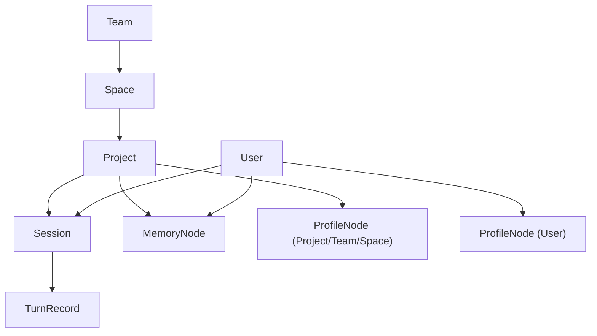

# VMM 当前架构与存储模型（中文）

## 文档目标

这份文档用于给当前主线实现提供一份总览级真源，统一说明：

- 层级模型与主键寻址方式
- 正式支持的运行模式
- 当前对外 gRPC 面
- 核心业务链和冷数据治理链

它不是历史方案评审，也不是逐列表结构快照。字段级细节应以代码和 proto 为准。

## 一、当前正式运行模式

当前主线保留两种正式运行模式：

### 1. `split`（默认）

- 关系数据：SQLite
- 向量数据：LanceDB
- 适合本地默认部署与最小依赖运行

### 2. `combined`（显式启用）

- 关系与向量：统一落 PostgreSQL
- 仅在 `storage.mode=combined` 且 `storage.combined_provider=postgres` 时启用

两种模式共享同一套 gRPC 契约、同一套 usecase 语义和同一套层级模型。

## 二、层级模型与确定性寻址

当前主线采用“确定性层级寻址”：

- 业务写链只传：
  - `project_id`
  - `user_id`
  - `session_id`
- 服务端根据 `project_id` 反查：
  - `space_id`
  - `team_id`
- 这些解析结果会继续落到关系存储与检索过滤条件中

层级关系如下：

关键约束：

- `Team -> Space -> Project` 是确定性树结构
- `Session` 绑定 `user_id + team_id + space_id + project_id`
- `TurnRecord` 只属于一个 `Session`
- 长期记忆和画像节点都携带可用于范围过滤的扁平化坐标

## 三、当前核心逻辑实体

当前主线的核心逻辑实体如下。

### 1. 范围与会话

- `users`
- `teams`
- `spaces`
- `projects`
- `sessions`
- `turn_records`

### 2. 长期记忆

- `memory_nodes`
- `memory_context_edges`

说明：

- `memory_nodes` 是长期记忆事实层
- `memory_context_edges` 用于保存 `support / rebuttal` 证据上下文
- 检索热路径只读取 `active` 且未过期的记忆

### 3. 画像系统

- `profile_nodes`
- `profile_instructions`
- `users.profile / projects.profile / teams.profile / spaces.profile`

说明：

- `profile_nodes` 是画像事实层
- `profile_instructions` 记录显式手工画像指令
- 各 scope 的 `profile` 字段只是渲染结果，不再是事实源

### 4. DWM / Scratchpad

- `scratchpad_plans`
- `scratchpad_nodes`

说明：

- `scratchpad_plans` 锁定 `project_id + user_id + session_key` 下唯一 canonical `plan_name`
- `scratchpad_nodes` 保存该计划下的确定性 `key/value` 锚点
- 这条链路独立于 `sessions / turn_records / memory_nodes`
- `session_id` 在这里仅作为字符串 `session_key` 使用
- 超过 `15` 天未更新时会直接硬删除，不进入 recycle trash
- 不参与 `MigrateProject`

### 5. 回收治理

- `recycle_batches`
- `recycle_jobs`
- `memory_nodes_trash`
- `memory_context_edges_trash`
- `turn_records_trash`
- `vector_gc_jobs`

说明：

- `recycle_jobs` 用于独立冷 `turn` 回收的 scan / claim / execute 分离
- 回收站只承担有限期防灾缓冲，不是产品级恢复台账

## 四、当前 gRPC 面

当前服务定义在：

- [internal/adapters/inbound/grpcapi/proto/v1/vmm.proto](../internal/adapters/inbound/grpcapi/proto/v1/vmm.proto)

服务名：

- `vmm.v1.VMMService`

### 1. 管理面

- `Healthz`
- `ListProjects`
- `ResolveProject`
- `EnsureProject`
- `DeleteProject`
- `MigrateProject`
- `ResolveUser`
- `ListUsers`
- `DeleteUser`

### 2. 画像接口

- `GetProfileNodes`
- `GetProfileBundle`
- `ApplyProfileInstruction`

### 3. AI 工具记忆接口

- `SearchMemoryEvents`
- `GetTurnDetails`
- `WriteMemories`

### 4. DWM 接口

- `ScratchpadUpsert`
- `ScratchpadDelete`
- `ScratchpadGet`
- `ScratchpadListKeys`
- `ScratchpadClean`

### 5. 业务主链

- `PreCheck`
- `ChatCompact`
- `PostAction`

## 五、统一范围解析规则

`PreCheck`、`ChatCompact`、`PostAction` 和主动写记忆链路都依赖统一范围解析结果。

规则如下：

1. 客户端不再传 `team_id / space_id`
2. `user_id / project_id` 必须是合法数字 ID
3. 服务端根据 `project_id` 反查 `space_id / team_id`
4. `session_id` 不存在时只允许自动创建 `session`
5. 不允许借由业务接口隐式创建 `user` 或 `project`

这个约束保证：

- 写入链和检索链看到的是同一套范围坐标
- 不会因为客户端重复传层级字段而产生漂移

例外：

- `Scratchpad*` 不走这条统一范围解析器
- 它不会自动创建 `vmm_sessions`
- 只校验 `project_id / user_id` 是否真实存在，并把 `session_id` 当成独立字符串键使用

## 六、当前核心业务链

### 1. `PreCheck`

当前是实时两层流程：

1. 读取最近 turn 热窗口
2. 第一层 `precheck_l1_main` 判断是否需要长期记忆，并生成多条检索语句
3. 统一检索链执行：
   - `vector`
   - `lexical`
   - `RRF`
   - `rerank(optional)`
   - `Weibull`
   - `context-aware scoring`
   - `MMR`
4. 第二层 `precheck_l2_main` 决定最终采纳项
5. 仅对最终采纳的 memory 写回生命周期
6. 只返回 `context_items[]`
   - `context_text` 已废弃，固定留空

### 2. `ChatCompact`

当前语义是：

- 把当前 session 最新已持久化的 turn 记为 compact 边界
- 通过 `last_compacted_turn_id` 控制当前 session 内可重开召回的 turn 范围

### 3. `PostAction`

当前语义是：

1. 同步校验、清洗并稳定落一条 turn
2. 同步把 session 入异步分析队列
3. 立即返回 `accepted=true`
4. 后台异步执行单轮 `postaction_l1_main`
5. 若产生记忆和画像候选，再统一走 `postaction_l2_main`
6. 最终写回：
   - turn `details`
   - `memory_nodes`
   - `memory_context_edges`
   - `profile_nodes`
   - 重建后的 scope `profile`

### 4. `WriteMemories`

当前语义是：

- 允许 AI 工具直接写入长期记忆，不生成 turn
- 先走短窗口软幂等
- 再走统一 reviewer 做语义去重或替代
- 最终只返回 `memory_id + deduped`

### 5. `Scratchpad*`

当前 DWM scratchpad 语义是：

1. `ScratchpadUpsert`
   - 首次写入会为当前 `project_id + user_id + session_id` 创建唯一计划锁
   - 后续写入必须继续命中同一 `plan_name`
   - `key + value` 与 `items[]` 不能混传
   - 批量写入采用整批原子事务
2. `ScratchpadDelete`
   - 要求传 `plan_name`
   - 但当前范围为空时不会锁定新计划，只返回引导消息
   - `key` 与 `keys[]` 不能混传
   - 批量删除采用整批原子事务
3. `ScratchpadGet`
   - 不带 `keys[]` 或传空数组时返回完整 scratchpad
   - 带 `keys[]` 时返回命中的多项或空数组
   - 返回 `plan_name / item_count / updated_timestamp`
4. `ScratchpadListKeys`
   - 不要求 `plan_name`
   - 直接返回当前 canonical `plan_name` 与完整有序 `keys[]`
   - 不返回任何 `value`
   - 返回 `key_count / updated_timestamp`
5. `ScratchpadClean`
   - 删除当前范围下的全部 scratchpad 节点与计划锁

计划守卫规则：

- 忽略大小写后不一致：
  - 拦截并返回英文提示
- 仅大小写不同：
  - 放行
  - 在 `msg` 前缀追加 `[FORMAT DRIFT WARNING]`

### 6. 画像接口

- `GetProfileNodes`
  - 只返回单目标下当前 `active` 的原子化画像节点
- `GetProfileBundle`
  - 按 `project_id + user_id` 组装一份确定性的 TEAM/SPACE/PROJECT/USER 组合结果
- `ApplyProfileInstruction`
  - 对单目标执行一次显式手工画像评审并落库

## 七、当前冷数据治理链

当前 `RetentionUseCase` 每轮维护顺序为：

1. 终态记忆回收
2. 独立冷 `turn` 扫描入队
3. 已领取冷 `turn` 回收任务执行
4. idle-session recycle
5. vector GC retry
6. trash purge

关键约束：

- 热窗口大小 = `post_action.session_analysis_history_turns + retention.turn_keep_extra_turns`
- 只有不再被主表记忆/画像引用的旧 `turn` 才允许进入冷回收
- 不为了提升归档率而破坏 `source_turn_id -> GetTurnDetails` 契约

## 八、当前重要契约

### 1. `source_turn_id -> GetTurnDetails`

- 只要对外返回了 `source_turn_id`
- 该 turn 就必须仍可通过 `GetTurnDetails` 查询到

因此：

- 冷 `turn` 回收优先保证契约稳定，而不是最大化归档率

### 2. `context_text` 已废弃

- `PreCheckResponse.context_text` 当前固定留空
- 上游应直接消费 `context_items[]`

### 3. Team / Space 自动画像仍不来自 `PostAction`

- 自动画像提炼当前只覆盖 `USER / PROJECT`
- `TEAM / SPACE` 画像通过显式手工指令维护

## 九、代码真源入口

如果需要继续核对实现，请优先从这些位置开始：

- proto：
  - [internal/adapters/inbound/grpcapi/proto/v1/vmm.proto](../internal/adapters/inbound/grpcapi/proto/v1/vmm.proto)
- 运行时装配：
  - [internal/app/app.go](../internal/app/app.go)
- `PostAction`：
  - [internal/app/usecase/postaction.go](../internal/app/usecase/postaction.go)
- `PreCheck`：
  - [internal/app/usecase/precheck.go](../internal/app/usecase/precheck.go)
- retention：
  - [internal/app/usecase/retention.go](../internal/app/usecase/retention.go)
- SQLite split 存储：
  - [internal/adapters/outbound/vldb_sqlite/store.go](../internal/adapters/outbound/vldb_sqlite/store.go)
- PostgreSQL combined 存储：
  - [internal/adapters/outbound/vldb_postgres/schema.go](../internal/adapters/outbound/vldb_postgres/schema.go)
